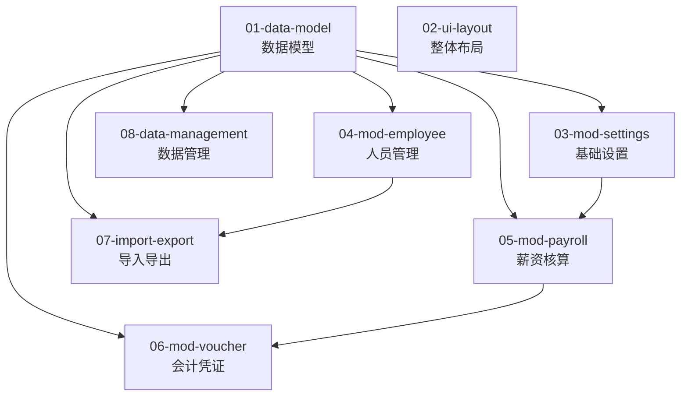

# 薪酬管理系统 · PRD 主索引

## 产品定位

面向中小企业的财务人员和人事专员，提供从员工信息管理、月度薪资核算、到会计凭证自动生成的一站式本地化工资核算工具。

## 核心价值

- **自动化**：输入员工基础信息和月度变量后，自动计算社保、公积金、个税、实发工资
- **合规性**：自动生成 5 张标准会计凭证，借贷平衡自动校验
- **多主体**：支持一套系统管理多个公司主体的员工，凭证可按主体筛选
- **本地化**：业务主数据存储在本地 SQLite，UI 轻配置使用本地缓存，全程无需联网，保护企业薪酬隐私

## 产品边界

| 包含 | 不包含 |
|------|--------|
| 员工基础信息管理 | 考勤系统（缺勤数据手动输入） |
| 社保公积金自动计算 | 累进制个税自动计算（个税金额手动输入） |
| 月度工资条生成 | 年终奖、年度汇算 |
| 5 张标准会计凭证 | 银行代发接口 |
| Excel 导入导出 | 与第三方系统集成 |
| PDF 工资条导出 | 电子签章 |
| JSON 数据备份恢复 | 云端同步 |

## 目标用户

| 角色 | 使用场景 |
|------|----------|
| **财务人员** | 每月核算工资、生成凭证、导出数据做账 |
| **人事专员** | 维护员工花名册、导出工资条 |
| **小企业老板** | 一人身兼财务和人事，需要简单易用的工资核算工具 |

## 典型工作流程

```
月初：维护人员信息（入职/离职/调薪）
  ↓
月中：输入月度变量（绩效工资、提成、奖金、缺勤、个税）
  ↓
一键生成：系统自动计算全员工资条
  ↓
核对：查看明细表、校验数据
  ↓
导出：PDF 工资条发给员工 / Excel 明细表存档
  ↓
做账：查看自动生成的 5 张凭证，导出 CSV 录入财务系统
```

## 模块清单与文件索引

| 文件 | 模块 | 说明 | 行数参考 |
|------|------|------|:-------:|
| `01-data-model.md` | 数据模型 | 所有 interface 定义，公共依赖 | ~140 |
| `02-ui-layout.md` | 整体布局 | 顶栏/弹层导航、概览三段式结构、1.2+1.html 视觉基线 | ~160 |
| `03-mod-settings.md` | 基础设置 | 组织信息、社保配置、公司主体 | ~80 |
| `04-mod-employee.md` | 人员管理 | 员工 CRUD、列表、详情 | ~60 |
| `05-mod-payroll.md` | 薪资核算 | 计算公式 + 卡片/明细表 UI | ~140 |
| `06-mod-voucher.md` | 会计凭证 | 5 张凭证规则、科目汇总、余额校验 | ~180 |
| `07-import-export.md` | 导入导出 | Excel/PDF/CSV 格式与触发点 | ~60 |
| `08-data-management.md` | 数据管理 | 备份恢复、清空、旧数据兼容 | ~70 |
| `09-nonfunctional.md` | 非功能性需求 | 性能、安全、兼容、国际化 | ~40 |
| `10-acceptance.md` | 验收标准 | 功能验收 + 打包验收 | ~40 |

## UI 基线约束（2026-02-15）

- 信息架构：采用 `plans/参考图/1.2.html`。
- 视觉 token：采用 `plans/参考图/1.html`（暖色中性 + 橙色主交互 + 统一阴影）。
- 技术架构保持不变：React + TypeScript + Vite + Tailwind/shadcn。
- 本次迁移仅调整布局与样式，不改业务逻辑、路由语义、IPC 接口。

## 模块依赖关系



## 阶段状态（2026-02-15）

| 模块 | 状态 | 说明 |
|------|------|------|
| 基础设置（03） | 已完成（P1） | 页面与存储已落地，回归通过 |
| 人员管理（04） | 已完成（P1） | 列表 CRUD、详情、导入导出已落地 |
| 导入导出（07） | 部分完成（P1） | 员工 Excel 导入导出已完成；薪资 CSV/PDF、凭证 CSV 待后续 |
| 数据管理（08） | 已完成（P1） | 备份/恢复/清空/存储信息 + evidence 已通过 |
| 薪资核算（05） | 待开发（P2） | 仍为下一阶段主任务 |
| 会计凭证（06） | 待开发（P3） | 依赖薪资汇总能力 |

## 下一步（P2 优先）

- 优先进入 `05-mod-payroll.md`：实现 `calculator.ts`、`PayrollByEmpPage`、`PayrollDetailPage`、工资条/PDF 导出。
- P2 关门标准保持不变：`calculator.test.ts` + `payroll-flow.spec.ts` + 三件套证据（raw JSON + case map + XLSX）。
- P2 完成后再进入 `06-mod-voucher.md` 的 P3 任务。

## 使用指南

**开发某个模块时**，只需加载该模块文件 + 其 `depends_on` 声明的依赖文件。例如：
- 开发凭证模块 → 加载 `01-data-model.md` + `06-mod-voucher.md`
- 开发员工管理 → 加载 `01-data-model.md` + `04-mod-employee.md`
- 全局架构评审 → 只加载本文件 `00-INDEX.md`

**新增功能模块时**：
1. 创建新文件 `11-mod-xxx.md`，头部声明依赖
2. 在本索引的模块清单中添加一行
3. 在依赖关系图中添加节点和连线
4. 如需扩展数据结构，同步更新 `01-data-model.md` 并递增版本号
